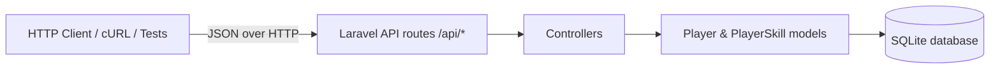
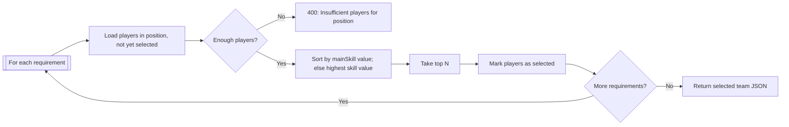
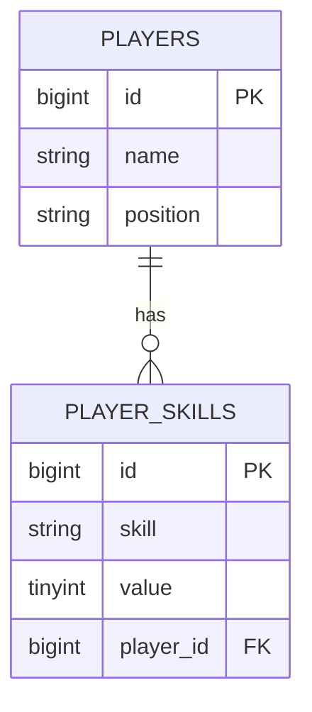

# RestFullPlayerApi

A Laravel 9 REST API built for a backend coding challenge. It manages a roster of football/soccer players — each with a `name`, a `position` (`defender`, `midfielder`, `forward`), and a set of skill ratings (`defense`, `attack`, `speed`, `stamina`, `strength`) — and exposes a team-selection endpoint that builds the strongest possible team from position and main-skill requirements. Candidates are ranked deterministically by their value in the requested main skill, falling back to a player's highest skill when the requested skill is absent. The project is a backend-only API backed by SQLite, with no frontend.

---

## Overview

The API exposes complete player CRUD plus an automated team-selection endpoint. Players and their skills live in two related SQLite tables; the team-selection endpoint reads that roster and applies a ranking strategy to assemble a team that satisfies a set of position + main-skill requirements, while ensuring no player is selected more than once. Built on Laravel 9 with PHP 8.1 and tested with PHPUnit against an in-memory database.

---

## Key Features

- **Player CRUD** — list, fetch, create, update, and delete players.
- **Player skills** — each player has one or more named skills with a numeric value, returned in a consistent nested structure.
- **Team selection** — ranked, non-repeating selection of players from position + main-skill requirements.
- **Validation** — restricts position/skill values, requires at least one skill, rejects duplicate skills and duplicate requirement combinations, and refuses insufficient roster depth.
- **Token-based protection** — destructive operations (delete) require a configuration-driven bearer token.

---

## Architecture



Requests are routed from the `/api` prefix to controllers, which delegate to the `Player` and `PlayerSkill` Eloquent models. Skills are eager-loaded on every player model, so reads and writes always return the full nested structure.

---

## Team Selection

`POST /api/team/process` implements a ranked, non-repeating selection algorithm.



**Request**

```json
[
  { "position": "defender", "mainSkill": "speed", "numberOfPlayers": 1 },
  { "position": "forward", "mainSkill": "attack", "numberOfPlayers": 2 }
]
```

**Steps**

1. Accept the array of requirements; reject empty requests.
2. Reject duplicate `position + mainSkill` combinations.
3. For each requirement, fetch players matching the `position` that have not already been selected.
4. Verify the available roster meets `numberOfPlayers`; otherwise return `400`.
5. Rank candidates by their value in `mainSkill`, falling back to their highest skill value when the requested skill is missing.
6. Select the top `numberOfPlayers` and mark them as used so no player appears twice.
7. Return the selected team.

**Response**

```json
[
  {
    "name": "Defender A",
    "position": "defender",
    "playerSkills": [ { "skill": "speed", "value": 95 } ]
  }
]
```

> **Note:** ranking uses the requested main skill (or the player's highest skill as a fallback), while the response includes the full skill list for each selected player.

---

## API Reference

All endpoints are served under the `/api` prefix.

| Method | Endpoint            | Description                        | Authentication |
| ------ | ------------------- | ---------------------------------- | -------------- |
| GET    | `/api/player/`      | List all players with skills       | None           |
| GET    | `/api/player/{id}`  | Fetch a single player with skills  | None           |
| POST   | `/api/player/`      | Create a player with skills        | None           |
| PUT    | `/api/player/{id}`  | Update a player and replace skills | None           |
| DELETE | `/api/player/{id}`  | Delete a player and its skills     | Bearer token   |
| POST   | `/api/team/process` | Select a team from requirements    | None           |

### Create a player — `POST /api/player/`

**Request**

```json
{
  "name": "Alice",
  "position": "defender",
  "playerSkills": [
    { "skill": "attack", "value": 60 },
    { "skill": "speed", "value": 80 }
  ]
}
```

**Response `201`**

```json
{
  "id": 1,
  "name": "Alice",
  "position": "defender",
  "playerSkills": [
    { "id": 1, "skill": "attack", "value": 60, "playerId": 1 },
    { "id": 2, "skill": "speed", "value": 80, "playerId": 1 }
  ]
}
```

### Update — `PUT /api/player/{id}`

Body has the same shape as create. Existing skills are replaced, and the `200` response reflects the newly persisted skills.

### Delete — `DELETE /api/player/{id}`

Requires the token as a bearer header:

```
Authorization: Bearer <PLAYER_API_TOKEN>
```

Response `200`:

```json
{ "message": "Player deleted successfully" }
```

### Error responses

| Status | Condition |
| ------ | --------- |
| `400`  | Invalid position/skill, no skills, duplicate skill, duplicate requirement combination, or insufficient players |
| `401`  | Missing/incorrect token on `DELETE` |
| `404`  | Player not found, or unmatched route |
| `429`  | API rate limit (60 requests/minute per IP) |

---

## Technology Stack

| Layer          | Technology                   | Version (source)        |
| -------------- | ---------------------------- | ----------------------- |
| Language       | PHP                          | `^8.1` (`composer.json`) |
| Framework      | Laravel                      | `^9.14` (`composer.json`) |
| API auth       | Config-driven bearer token   | `PLAYER_API_TOKEN`      |
| CORS           | fruitcake/laravel-cors       | `^3.0` (`composer.json`) |
| HTTP client    | guzzlehttp/guzzle            | `^7.4.3` (`composer.json`) |
| Database       | SQLite                       | —                       |
| Testing        | PHPUnit                      | `^9.5.20` (`composer.json`) |

> Laravel Sanctum (`^2.15`) is included as part of the standard Laravel scaffold (it backs the default `/api/user` route), but the API's protected operations use a configuration-driven bearer token.

---

## Database

The project uses SQLite. A ready, migrated database ships at `database/database.sqlite`. Tests run against an in-memory SQLite database (`:memory:`), so they never touch the on-disk file.

Two domain tables model the roster:

| Table | Key columns |
| ----- | ----------- |
| `players` | `id` (PK), `name`, `position`, `created_at`, `updated_at` |
| `player_skills` | `id` (PK), `skill`, `value`, `player_id` (FK → `players.id`, cascade delete) |



`Player` has many `PlayerSkill`, eager-loaded by default. Skills are replaced on update and cascaded on player delete. (The remaining scaffold tables — `users`, `personal_access_tokens`, `password_resets`, `failed_jobs` — are standard Laravel defaults and not used by this API.)

---

## Project Structure

```text
RestFullPlayerApi/
├── app/
│   ├── Enums/
│   │   ├── PlayerPosition.php   # defender | midfielder | forward
│   │   └── PlayerSkill.php      # defense | attack | speed | stamina | strength
│   ├── Http/
│   │   ├── Controllers/PlayerController.php  # all player + team endpoints
│   │   └── Kernel.php
│   ├── Models/
│   │   ├── Player.php           # name, position, hasMany skills
│   │   └── PlayerSkill.php      # skill, value, belongsTo player
│   └── Providers/
├── config/services.php          # PLAYER_API_TOKEN configuration
├── database/
│   ├── migrations/              # players, player_skills, users, etc.
│   └── database.sqlite          # provided SQLite database (empty, migrated)
├── routes/api.php               # API route definitions
├── tests/Feature/               # player CRUD + team feature tests
├── .env.example
├── composer.json / composer.lock
├── phpunit.xml
└── webpack.mix.js
```

---

## Installation

### Prerequisites

- PHP **8.1+**
- Composer

### Setup

```bash
git clone https://github.com/HidayahMF/RestFullPlayerApi.git
cd RestFullPlayerApi
composer install
cp .env.example .env
php artisan key:generate
```

`.env.example` is pre-configured for **SQLite**, and the provided, already-migrated `database/database.sqlite` is used by default — so **no migration step is required** to run the API.

### Run

```bash
php artisan serve --port=3000
```

The API is available at `http://localhost:3000/api/...` (e.g. `GET http://localhost:3000/api/player/`).

---

## Testing

```bash
php artisan test
```

**Result: `30 passed`**

The suite (in-memory SQLite) covers:

| Area | Coverage |
| ---- | -------- |
| **Create** | Valid creation & response, persistence, invalid position/skill, no skills, duplicate skills |
| **List / Show** | Empty list, list with data, show single player, show missing (`404`) |
| **Update** | Update existing, replace skills in response, missing (`404`), invalid position, duplicate skills |
| **Delete** | Requires token (`401`), deletes with valid token, missing (`404`) |
| **Team** | Best-player selection, non-reuse, insufficient players, duplicate requirements, empty requirements, skill fallback |

---

## Security

- **Token handling** — the `DELETE` token is configuration-driven (`PLAYER_API_TOKEN` → `config('services.player_api_token')`), not hard-coded in the controller. Set a unique token per deployment.
- **`.env` usage** — `.env` is git-ignored and untracked; only the secret-free `.env.example` is committed. Never commit real tokens or keys.
- **CORS** — permissive for all origins so the public API is consumable from any client; tighten `allowed_origins` in production if needed.
- **Rate limiting** — API routes are throttled at 60 requests/minute per IP.
- **Access model** — player reads/writes and team selection are public by design; only the destructive `DELETE` endpoint is token-protected.

---

## Challenge Constraints

- PHP `8.1`
- Laravel `>= 9.14`
- SQLite
- No additional libraries beyond the Laravel defaults
- `composer.json` and `composer.lock` must not be modified
- The provided database structure must not be changed (no extra migrations/seeders)

---

## Future Improvements

- Broader integration testing, including a dedicated team-selection unit suite.
- API versioning (e.g., `/api/v1/...`).
- Optional auth scope for create/update operations.
- DB-level constraints (check/enum) for position and skill values in non-challenge deployments.
- Production deployment automation (Docker + CI) and tightened CORS for a hosted environment.

---

## Author

**Hidayah MF** — GitHub: [@HidayahMF](https://github.com/HidayahMF)
