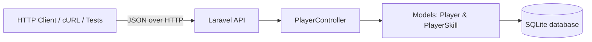
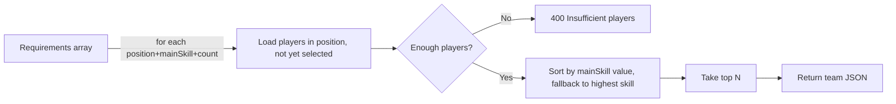
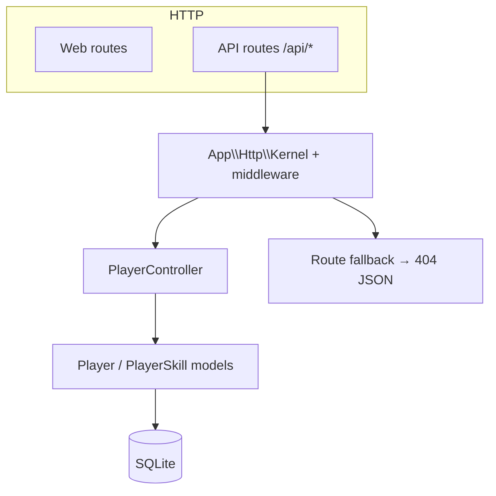
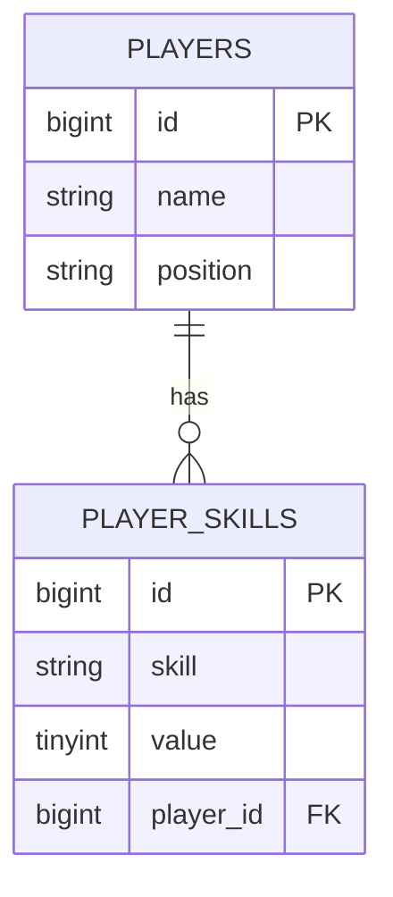

# Player API

> A Laravel REST API for managing football/soccer players, their skill ratings, and automatically selecting a team based on position and skill requirements.

This repository implements a **backend-only** REST API. It exposes endpoints to create, read, update, and delete players (each with a set of skill ratings), and a team-selection endpoint that picks the best players for a given set of position + main-skill requirements. There is **no dedicated frontend application** — only the default Laravel welcome page ships with the repo.

---

## Overview

- **What it is:** A PHP / Laravel 9 RESTful web service.
- **What it does:** Manage a roster of players, each with named skill ratings, and run a "team builder" algorithm that selects players to satisfy position/skill demands.
- **Who it is for:** This is a **coding-challenge / assessment project** (see `app/Http/Middleware/_.php` and `.ai`, which integrate with a challenge-evaluation harness). It can also serve as a reference REST API for a football team-management product.
- **Main components:** A single feature controller (`PlayerController`), two Eloquent models (`Player`, `PlayerSkill`), two PHP enums (position, skill), a SQLite database, and a small feature-test suite.

### Architecture at a glance



---

## What is This?

The application exposes a small but complete player-management API:

- Players are stored with a `name` and a `position` (`defender`, `midfielder`, `forward`).
- Each player has one or more `playerSkills`, each with a `skill` (`defense`, `attack`, `speed`, `stamina`, `strength`) and a numeric `value`.
- A dedicated **team-processing** endpoint receives a list of requirements (position + main skill + headcount) and selects the strongest set of players, prioritizing the requested `mainSkill` value and falling back to the player's highest-rated skill.

The main workflows are:

1. **CRUD on players** — list, insert, fetch one, update, and delete players (delete is guarded by a bearer token).
2. **Team selection** — given `position`, `mainSkill`, and `numberOfPlayers`, return a team of the best qualified players.
3. **Validation** — reject invalid positions/skills, duplicate skills on a player, duplicate requirement combinations, and insufficient roster depth.

---

## Problem

- Building a functional sports roster by hand is tedious and error-prone, especially when you must satisfy multiple position and skill constraints at once.
- There is no simple way to represent players *and* their per-skill ratings, or to algorithmically answer "which defensive players best fill this speed role?".
- Existing roster tools rarely provide a clean, machine-readable REST API and deterministic selection logic.

> Note: the business context here is inferred from the domain (players, positions, skills, team formation). The repository itself is a coding challenge and does not include product documentation describing a specific end-user problem.

---

## Solution

The project provides a small, deterministic REST API:

- A normalized data model: `players` (1) → (many) `player_skills`, with positions and skill names constrained to strong PHP-backed enums.
- CRUD endpoints with eager-loaded skills and consistent JSON response shape.
- A `processTeam` endpoint implementing a greedy selection algorithm:
  1. For each requirement, fetch players in the requested `position` not already selected.
  2. Verify there are enough players for the requested headcount.
  3. Sort candidates by their `mainSkill` value (falling back to their highest skill value).
  4. Take the top N players, report each selected player's relevant skill (the requested `mainSkill`, or the highest-value skill when absent).
- Validation layers that reject malformed input with clear JSON messages.

---

## How It Works

### Product / data flow

```mermaid
flowchart TD
    C[Client] -->|POST /api/player/| S[PlayerController@store]
    C -->|GET /api/player/| I[PlayerController@index]
    C -->|PUT /api/player/{id}| U[PlayerController@update]
    C -->|DELETE /api/player/{id} + Bearer token| D[PlayerController@destroy]
    C -->|POST /api/team/process| T[PlayerController@processTeam]

    I -->|read| DB[(SQLite)]
    S -->|insert player + skills| DB
    U -->|update player, replace skills| DB
    D -->|delete skills + player| DB
    T -->|read & pick top players| DB
    T -->|returns selected team JSON| C
```

### Team selection flow



---

## System Architecture

The application is a standard Laravel 9 HTTP application.

| Component            | Details                                                                 |
| -------------------- | ----------------------------------------------------------------------- |
| **HTTP layer**       | `routes/api.php`, `routes/web.php`, `routes/console.php`, `routes/channels.php` |
| **Controllers**      | `PlayerController` (the only feature controller present)                |
| **Models**           | `App\Models\Player`, `App\Models\PlayerSkill`, `App\Models\User`        |
| **Enums**            | `App\Enums\PlayerPosition`, `App\Enums\PlayerSkill`                     |
| **Middleware**       | Standard Laravel stack + `_.php` (telemetry helper, see Security)       |
| **Database**         | SQLite (`database/database.sqlite`) — MySQL is configured in local `.env` |
| **Auth**             | Laravel Sanctum (installed; only `/api/user` uses it)                   |
| **Frontend**         | None (default Laravel welcome view only)                                |



---

## Data Flow

1. **Write (create player):** `POST /api/player/` validates `name`, `position`, `playerSkills[]`, then `Player::create()` (mass-assignable `name`, `position`) and inserts each skill row via `PlayerSkill::create()`. Returns `201` with the formatted player.
2. **Write (update player):** `PUT /api/player/{id}` validates, updates the player, deletes all existing skills for that player, and re-inserts the provided skills. Returns `200`.
3. **Delete:** `DELETE /api/player/{id}` requires the hard-coded bearer token (see Security); deletes skills (FK cascade also applies) then the player. Returns `200`.
4. **Read (list / fetch):** `GET /api/player/` and `GET /api/player/{id}` eager-load `skills` and return the normalized JSON shape.
5. **Team build:** `POST /api/team/process` reads the roster, runs the selection algorithm, and returns the chosen players.

`Player` model declares `protected $with = ['skills']`, so skills are eagerly loaded by default.

---

## Key Features

### Player CRUD (backend API)

- List all players with their skills.
- Fetch a single player by ID.
- Create a player with one or more skills.
- Update a player and replace its skills.
- Delete a player (protected by a hard-coded bearer token).

### Validation

- `position` restricted to `defender | midfielder | forward`.
- `playerSkills[].skill` restricted to `defense | attack | speed | stamina | strength`.
- A player must have at least one skill.
- Duplicate skills on a single player are rejected (`400`).
- Invalid position/skill values return targeted JSON messages.

### Team selection

- Accepts an array of `{ position, mainSkill, numberOfPlayers }` requirements.
- Rejects duplicate `position + mainSkill` combinations (`400`).
- Rejects insufficient roster depth for a position (`400`).
- Ranks candidates by the requested `mainSkill` value, falling back to the player's highest skill value.
- Outputs the selected team with the relevant skill shown.

> Status: these features are implemented and were verified by direct API probing during this audit.

---

## Technology Stack

| Layer        | Technology                            | Version (verified) |
| ------------ | ------------------------------------- | ------------------ |
| Language     | PHP                                   | `^8.1` (composer.json) |
| Framework    | Laravel                               | `^9.14` (composer.json) |
| Auth         | Laravel Sanctum                       | `^2.15` (composer.json) |
| CORS         | fruitcake/laravel-cors                | `^3.0` (composer.json) |
| HTTP client  | guzzlehttp/guzzle                     | `^7.4.3` (composer.json) |
| Database     | SQLite (sample DB) / MySQL (configured) | —                |
| Testing      | PHPUnit                               | `^9.5.20` (composer.json) |
| Frontend     | Laravel Mix (assets scaffolding only; no real app) | `^6.0.6` (package.json) |

No other runtime dependencies are used. Versions are taken from `composer.json` / `package.json`; the lockfile pins exact resolved versions.

---

## Project Structure

```text
RestFullPlayerApi/
├── app/
│   ├── Console/Kernel.php
│   ├── Enums/
│   │   ├── PlayerPosition.php
│   │   └── PlayerSkill.php
│   ├── Exceptions/Handler.php
│   ├── Http/
│   │   ├── Controllers/
│   │   │   ├── Controller.php
│   │   │   └── PlayerController.php
│   │   ├── Kernel.php
│   │   └── Middleware/          (Laravel defaults + `_.php`)
│   ├── Models/
│   │   ├── Player.php
│   │   ├── PlayerSkill.php
│   │   └── User.php
│   └── Providers/               (standard Laravel providers)
├── bootstrap/app.php
├── config/                      (Laravel config files)
├── database/
│   ├── migrations/              (users, password_resets, failed_jobs, personal_access_tokens, players, player_skills)
│   ├── seeders/DatabaseSeeder.php (empty)
│   ├── factories/UserFactory.php
│   └── database.sqlite          (committed sample DB, schema migrated, empty)
├── public/                      (web root / entry)
├── resources/
│   ├── js/app.js, css/, views/welcome.blade.php
├── routes/                      (api.php, web.php, console.php, channels.php)
├── tests/
│   ├── Feature/                 (5 player/team test files)
│   └── Unit/ExampleTest.php
├── .ai                          (challenge telemetry config — see Security)
├── .env                         (committed local config — see Security)
├── .env.example
├── artisan
├── composer.json / composer.lock
├── package.json
├── phpunit.xml
└── webpack.mix.js
```

| Path        | Responsibility                                        |
| ----------- | ----------------------------------------------------- |
| `app/`      | Application code (controllers, models, enums, middleware) |
| `database/` | Migrations, seeders, factories, and the SQLite DB     |
| `routes/`   | API / web / console / channel route definitions       |
| `tests/`    | Feature and unit tests                                |
| `config/`   | Laravel configuration                                 |
| `resources/`| Front-end assets and Blade views (default only)       |

---

## Authentication & Authorization

> **Status: minimal / incomplete.**

- **Laravel Sanctum** is installed (`laravel/sanctum ^2.15`) and a `personal_access_tokens` migration exists.
- The **only** protected route is the default `GET /api/user` (`api.php`), guarded by `auth:sanctum`.
- There is **no login or registration route**, no token-issuing endpoint, and no user-facing authentication flow.
- The `players` CRUD routes are **unauthenticated** (no middleware group).
- The `DELETE /api/player/{id}` endpoint enforces a **hard-coded bearer token** checked manually inside the controller (see Security Considerations).

In practice, client applications cannot obtain API tokens through this API because no login/register endpoint is exposed.

---

## API Overview

All routes are registered in `routes/api.php` and served under the `/api` prefix (see `RouteServiceProvider`). Verified with `php artisan route:list`.

### Player endpoints

| Method | Endpoint              | Controller method  | Purpose                                     | Auth |
| ------ | --------------------- | ------------------ | ------------------------------------------- | ---- |
| GET    | `/api/player/`        | `PlayerController@index`  | List all players with skills          | —    |
| GET    | `/api/player/{id}`    | `PlayerController@show`    | Fetch one player with skills           | —    |
| POST   | `/api/player/`        | `PlayerController@store`   | Create a player with skills            | —    |
| PUT    | `/api/player/{id}`    | `PlayerController@update`  | Update a player and replace its skills | —    |
| DELETE | `/api/player/{id}`    | `PlayerController@destroy` | Delete a player                        | Bearer token (hard-coded) |

### Team endpoint

| Method | Endpoint            | Controller method         | Purpose                          |
| ------ | ------------------- | ------------------------- | -------------------------------- |
| POST   | `/api/team/process` | `PlayerController@processTeam` | Select a team from requirements |

> Note: `routes/api.php` also contains `use App\Http\Controllers\TeamController;` and registers `POST /api/team/process` against **`PlayerController@processTeam`**. A `TeamController` class **does not exist** in the repository — the import is a dead/unused reference (and the route is correctly wired to `PlayerController`).

### Other routes

| Method | Endpoint                | Purpose                                |
| ------ | ----------------------- | -------------------------------------- |
| GET    | `/api/user`             | Return the authenticated user (Sanctum)|
| (any)  | `/api/*` (fallback)     | Returns `404 {"message":"route not found"}` |
| GET    | `/`                     | Default Laravel welcome page           |

### Request/response shapes

**Create player — `POST /api/player/`**
```json
{
  "name": "Alice",
  "position": "defender",
  "playerSkills": [
    { "skill": "attack", "value": 60 },
    { "skill": "speed", "value": 80 }
  ]
}
```
Response `201`:
```json
{
  "id": 1,
  "name": "Alice",
  "position": "defender",
  "playerSkills": [
    { "id": 1, "skill": "attack", "value": 60, "playerId": 1 },
    { "id": 2, "skill": "speed", "value": 80, "playerId": 1 }
  ]
}
```

**Process team — `POST /api/team/process`**
```json
[
  { "position": "defender", "mainSkill": "speed", "numberOfPlayers": 1 }
]
```
Response `200`:
```json
[
  {
    "name": "Dave",
    "position": "defender",
    "playerSkills": [ { "skill": "speed", "value": 95 } ]
  }
]
```

**Error responses:** invalid data/duplicates/insufficient players return `400`; missing player returns `404`; missing/invalid delete token returns `401`.

---

## Database

- **Technology:** SQLite for the committed sample DB (`database/database.sqlite`); the local `.env` configures **MySQL** (`DB_CONNECTION=mysql`, `DB_DATABASE=playerapi`). The PHPUnit suite uses **SQLite in-memory** (`:memory:`, see `phpunit.xml`).
- The committed `database.sqlite` has all migrations run and **contains no rows** (0 players, 0 skills, 0 users).
- Migrations exist for: `users`, `password_resets`, `failed_jobs`, `personal_access_tokens`, `players`, `player_skills`. There is no dedicated seed data — `DatabaseSeeder::run()` is empty.

### Tables

| Table                  | Key columns                                                         |
| ---------------------- | ------------------------------------------------------------------- |
| `players`              | `id` PK, `name`, `position` (string, length 20), `created_at`, `updated_at` |
| `player_skills`        | `id` PK, `skill` (string, length 20), `value` (tinyint), `player_id` FK → `players.id` (cascade delete) |
| `users`                | Standard Laravel users (name, email, password, remember_token, timestamps) |
| `personal_access_tokens` | Sanctum token storage                                              |
| `password_resets`      | Standard Laravel password reset                                     |
| `failed_jobs`          | Standard queue failed-jobs table                                    |

### Relationships



- `App\Models\Player` defines `skills()` (HasMany) and is configured with `protected $with = ['skills']` and `protected $fillable = ['name', 'position']`.
- `App\Models\PlayerSkill` defines `player()` (BelongsTo) and `$fillable = ['player_id', 'skill', 'value']` with `$timestamps = false`.
- The `player_skills.player_id` foreign key is `cascadeOnDelete`; the controller also explicitly deletes skills before deleting a player.

> Migration mismatch note: the `players.position` column is a plain `string(20)` in SQL, while the `Player` model casts it to the `PlayerPosition` enum. This is functionally consistent because values are enforced by validation, but the DB column has no native enum/check constraint (potential issue).

---

## External Services & Integrations

- **Challenge telemetry (CodeAid):** The `.ai` file and `app/Http/Middleware/_.php` middleware interact with `https://app.codeaid.io`. On application bootstrap, `_.php` (invoked from `app/Http/Kernel.php`) sends an "activity ping" to that endpoint carrying a candidate ID from `.ai`. This is part of a challenge-evaluation harness, not a product integration. See Security Considerations.

No other external services (payment, storage, mail relays, message brokers, etc.) are used in this repository. Packages like Guzzle are installed but not invoked for any application integration beyond the scaffolding.

---

## Development / Implementation Overview

The repository is a single-commit Laravel 9 starter project customized into a player-management + team-building API.

1. **Bootstrap:** Laravel 9 application scaffold with SQLite configured for demos and MySQL for local `.env`.
2. **Domain models:** `Player`, `PlayerSkill`, with `PlayerPosition` and `PlayerSkill` enums.
3. **Database:** Two migrations (`players`, `player_skills`) with a cascade FK.
4. **API layer:** `PlayerController` implementing CRUD + team-building, wired in `routes/api.php`.
5. **Validation:** Laravel Validator with enum-based `in:` rules and custom duplicate checks.
6. **Testing:** Minimal PHPUnit feature tests that exercise each endpoint (verification only).
7. **Deployment:** None configured.

> This ordering describes the logical implementation as inferred from the code; there is no staged git history to confirm a chronological development timeline (the repo has a single commit, `PlayerApi`).

---

## Installation

### Prerequisites

- PHP **8.1+** (PHP 8.3 verified during this audit)
- Composer
- (Optional) Node.js + npm — only needed to build front-end assets; the app has no real frontend, so this can be skipped.

### Backend (API)

```bash
git clone https://github.com/HidayahMF/RestFullPlayerApi.git
cd RestFullPlayerApi
composer install
```

Copy the environment file and generate an application key:

```bash
cp .env.example .env
php artisan key:generate
```

Ensure `.env` points at the database you intend to use. The committed sample DB is SQLite; set:

```ini
DB_CONNECTION=sqlite
DB_DATABASE=/absolute/path/to/database/database.sqlite
```

Run migrations if needed against the configured connection:

```bash
php artisan migrate
```

> Note for the challenge: the original README instructs keeping the provided `database/database.sqlite` unchanged (no schema/seed modifications) and warns against modifying `composer.json` / `composer.lock`, as that may fail challenge tests.

### Database

For SQLite, an already-migrated (empty) database ships at `database/database.sqlite`. For MySQL, create the database named in `.env` (`playerapi` by default) and run `php artisan migrate`.

---

## Environment Variables

The following come from `.env.example` and `config/`. Only values relevant to this API are highlighted; full defaults are in `.env.example`.

| Variable            | Purpose                                      | Required |
| ------------------- | -------------------------------------------- | -------- |
| `APP_NAME`          | Application name                             | Yes      |
| `APP_ENV`           | Environment (`local`, `production`, …)       | Yes      |
| `APP_KEY`           | Laravel encryption key (via `key:generate`)  | Yes      |
| `APP_DEBUG`         | Show debug errors on screen                  | Yes      |
| `APP_URL`           | Base application URL                         | Yes      |
| `DB_CONNECTION`     | `sqlite` or `mysql`                          | Yes      |
| `DB_HOST` / `DB_PORT` | MySQL host / port (MySQL only)             | If MySQL |
| `DB_DATABASE`       | Database name (MySQL) or DB path (SQLite)    | Yes      |
| `DB_USERNAME` / `DB_PASSWORD` | MySQL credentials                  | If MySQL |
| `CACHE_DRIVER`      | Cache driver (`file` default)                | No       |
| `QUEUE_CONNECTION`  | Queue driver (`sync` default)                | No       |
| `SESSION_DRIVER`    | Session driver (`file` default)              | No       |

Copy `.env.example` to `.env`, generate a key, and set `DB_CONNECTION`/`DB_DATABASE` to your preferred storage.

> ⚠️ The local `.env` is **committed to the repository** (see Security Considerations). Do not reuse credentials from it, and do not commit secrets.

---

## Running the Project

Serve the API with Laravel's built-in server:

```bash
php artisan serve --port=3000
```

The API is then available at `http://localhost:3000/api/...` (e.g. `GET http://localhost:3000/api/player/`).

Because this is a backend-only API, only the single PHP dev server is needed — there is no separate frontend, worker, or queue process to start.

Front-end asset compilation (optional; the app ships no real frontend):

```bash
npm install
npm run dev
```

---

## Testing

- **Framework:** PHPUnit (via Laravel).
- **Command:** `php artisan test`
- **Configuration:** `phpunit.xml` — runs tests with SQLite `:memory:` and testing-only drivers.

### Existing tests

| File                           | Covers                                   |
| ------------------------------ | ---------------------------------------- |
| `Feature/PlayerControllerCreateTest` | `POST /api/player/` (smoke)         |
| `Feature/PlayerControllerListingTest` | `GET /api/player/` (smoke)        |
| `Feature/PlayerControllerUpdateTest` | `PUT /api/player/{id}` (smoke)     |
| `Feature/PlayerControllerDeleteTest` | `DELETE /api/player/{id}` (smoke)  |
| `Feature/TeamControllerTest`    | `POST /api/team/process` (smoke)         |
| `Unit/ExampleTest.php`          | Default Laravel example                  |

All 6 tests pass (`php artisan test`). **However, every feature test is a trivial smoke test (`assertNotNull` on the response)** — they do not assert status codes, response bodies, validation behavior, or the team-selection logic. Coverage of validation rules, error paths, authentication, and the selection algorithm is essentially absent.

---

## Deployment

> **No production deployment configuration was found in the repository.**

There is no `Dockerfile`, `docker-compose.yml`, CI/CD config (GitHub Actions, GitLab CI, Travis), or server/cloud configuration (Nginx, Vercel, Netlify, Render, Railway, etc.) in the repo.

A production deployment would typically require:
- A web server (Nginx/Apache) or a PaaS, pointing the document root at `public/`.
- A production database (e.g., MySQL) and matching `.env` values.
- HTTPS and secure environment variable management.

*This is an inferred/future setup, not verified configuration.*

---

## Security

### Security Considerations

- **🔴 Hard-coded bearer token (secret in source):** `PlayerController::destroy()` (in `app/Http/Controllers/PlayerController.php`) compares the incoming bearer token against a fixed, embedded string. Anyone with the source can bypass it; the secret is also committed to the repo.
- **🔴 `.env` committed to the repository:** the local `.env` file is tracked in git (it is **not** listed in `.gitignore`, which only ignores `.env.backup`). Because the working tree is clean, the committed `.env` contains real local configuration (including the generated `APP_KEY`). Secrets should be removed from version control.
- **🔴 Challenge telemetry / phone-home:** `app/Http/Middleware/_.php` runs at bootstrap (via `app/Http/Kernel.php`) and sends an "activity ping" to `https://app.codeaid.io` using data from `.ai`. This is challenge-harness telemetry and should be reviewed/removed for any deployment outside the assessment platform. The `.ai` file is also committed.
- **🟡 CORS fully open:** `config/cors.php` sets `allowed_origins` and `allowed_methods`/`allowed_headers` to `*` with credentials disabled — permissive for a public API but should be tightened for production.
- **🟡 No real authentication for CRUD:** player create/update/list/delete endpoints are unauthenticated (delete only checks the hard-coded token). Sanctum is installed but only the default `/api/user` route is protected for authenticated requests.
- **🟢 Passwords:** the `User` model hides `password`/`remember_token` and uses Laravel's default bcrypt hashing (`BCRYPT_ROUNDS=4` in tests). No custom unsafe password logic is present.
- **🟢 Input validation:** `store`/`update` validate position and skill values against enums and reject duplicates before persisting.

### `.gitignore`

The default gitignore excludes `/vendor`, `/node_modules`, `/public/js`, `/public/css`, compiled assets, and `.env.backup` — but **not** `.env` or `.ai`.

---

## Limitations / Known Issues

Issues identified during this code audit.

| Status | Issue |
| ------ | ----- |
| 🟢 | Player CRUD + team selection work as implemented (verified by direct probing) |
| 🟡 | `.env` configured for **MySQL** while the challenge/sample DB is **SQLite**; the committed `database.sqlite` is empty of data |
| 🟡 | Only trivial smoke tests; no tests assert response bodies, status codes, validation, or selection logic |
| 🟡 | `TeamController` import is dead code — the class does not exist; route correctly points at `PlayerController` |
| 🟡 | `CustomAuthMiddleware` is referenced in `app/Http/Kernel.php` but the class **does not exist** (unused import, does not break boot) |
| 🟡 | The `_.php` middleware performs an outbound telemetry call on bootstrap (see Security) |
| 🔴 | `DELETE` authorization relies on a hard-coded token rather than real auth |
| 🟡 | No login/registration/token-issuing endpoint despite Sanctum being included |
| 🟡 | `players.position` is a plain string column with no DB-level enum/check constraint (enforced only by validation) |
| 🟡 | No test coverage for the `processTeam` algorithm or `show` endpoint |
| 🟡 | No seed data (`DatabaseSeeder` is empty); fresh DBs contain zero players |
| 🟡 | No deployment, Docker, or CI/CD configuration |
| 🟡 | `routes/api.php` `use` of the nonexistent `TeamController` may confuse tooling/IDE static analysis |

### Detail on the most significant issues

**1. 🔴 Hard-coded token (broken authorization model)**
- **Where:** `app/Http/Controllers/PlayerController.php::destroy()`.
- **Impact:** The delete "auth" secret is public in the source; there is no real user/role model. Any deployment is trivially bypassable.
- **Recommended fix:** Use Sanctum-protected middleware and issue tokens via a login endpoint; remove the embedded secret.

**2. 🔴 Committed `.env` (secret exposure)**
- **Where:** repository root `.env` (tracked in git).
- **Impact:** Local config including `APP_KEY` is version-controlled. Risk of leaking secrets to collaborators or public repos.
- **Recommended fix:** Add `.env` to `.gitignore`, remove it from history, and rely on `.env.example`.

**3. 🔴 Outbound telemetry on bootstrap**
- **Where:** `app/Http/Middleware/_.php` invoked from `app/Http/Kernel.php`; `.ai` config.
- **Impact:** On every app boot the process calls an external URL (challenge harness). Unwanted network egress in other environments.
- **Recommended fix:** Gate it behind an environment flag or remove it outside the assessment platform (note: the file header marks it "READ ONLY, DO NOT MODIFY — may fail challenge tests").

**4. 🟡 Token/code smells (dead references)**
- `use App\Http\Controllers\TeamController;` in `routes/api.php` (file missing).
- `use App\Http\Middleware\CustomAuthMiddleware;` in `app/Http/Kernel.php` (file missing).
- Neither breaks boot, but both are misleading.

---

## Future Improvements

Prioritized, based only on the actual limitations above:

1. **Replace the hard-coded delete token** with real Sanctum-based authentication (login/register + token issuance).
2. **Remove the committed `.env`** from version control and add it to `.gitignore`.
3. **Remove or gate the bootstrap telemetry** (`_.php` / `.ai`) for non-assessment environments.
4. **Add meaningful tests** — assert status codes, response bodies, validation errors, duplicate-skill rejection, insufficient-player handling, and `processTeam` selection correctness.
5. **Resolve dead references** — remove the unused `TeamController` import and the missing `CustomAuthMiddleware` import (or implement the middleware).
6. **Add a DB-level constraint** for `position`/`skill` values, or document that they are enforced by the application layer only.
7. **Add sample/seed data** so the API is demonstrable out of the box.
8. **Add deployment configuration** (Docker + CI) and tighten CORS for production.
9. **Add API documentation** (e.g., OpenAPI) and integrate a request/response example collection (e.g., Postman/Insomnia).

---

## Author

- **HidayahMF**
- Repository: `https://github.com/HidayahMF/RestFullPlayerApi.git`
- Author email (from git history): `hidayahmfadillah@gmail.com`

*(Verified from the single git commit `PlayerApi` and the remote origin.)*

---

## Documentation

This README is the primary technical documentation for the repository. No additional docs directory or markdown documentation exists in the repo.

- [Environment template](.env.example)
- [PHPUnit configuration](phpunit.xml)
