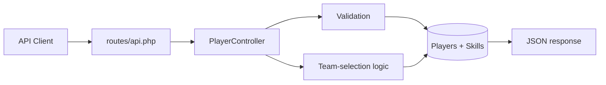
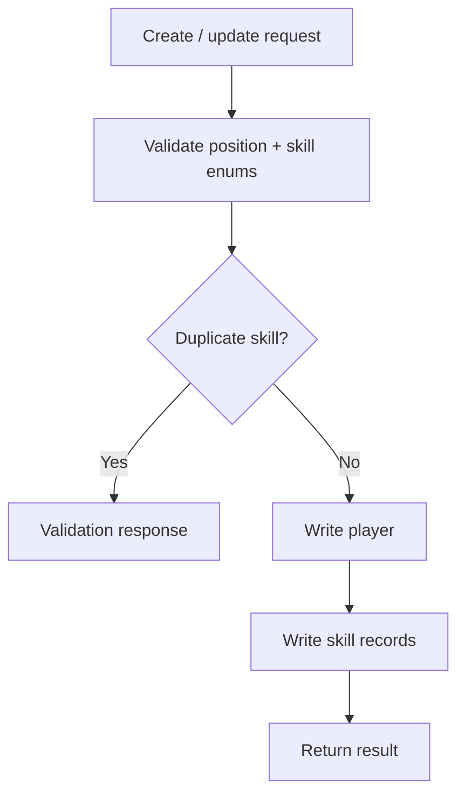
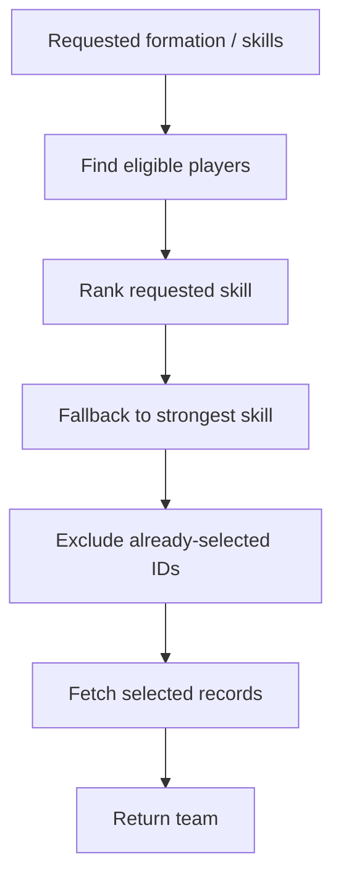
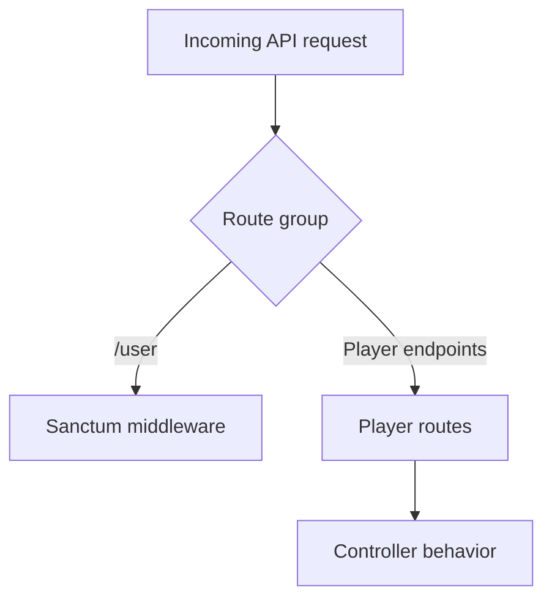
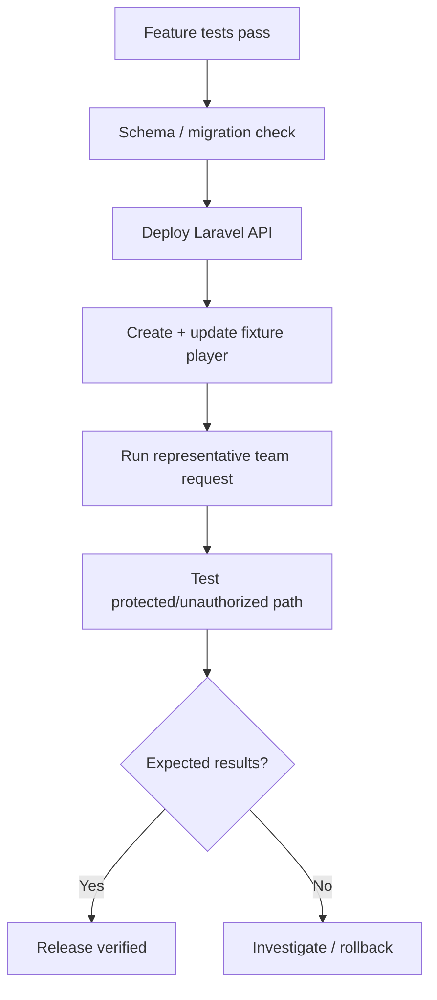

# ⚽ RestFullPlayerApi — Engineering Blueprint

> **Laravel player-service pipeline:** validated player CRUD, skill persistence, and rule-based team selection.

**Reviewed snapshot:** `main` @ [`d018da4be725`](https://github.com/HidayahMF/RestFullPlayerApi/commit/d018da4be72567866e54fa61e57e9a731117e223) — 2026-09-17

## ⚡ System snapshot

| Area | Implementation |
| --- | --- |
| API | Laravel |
| Persistence | Eloquent player + skill records |
| Core domain | Player CRUD + team selection |
| Automated tests | Focused Laravel feature tests |
| CI | No `.github/workflows/` found in reviewed snapshot |

## 🏗️ API architecture

## 👤 Player write flow

## 🧠 Team-selection engine

> The reviewed code builds a ranking before the final fetch, but the final query does **not necessarily preserve that ranking order**. Treat output ordering as something to verify explicitly.

## 🗺️ Code ownership map

| Source | Owns |
| --- | --- |
| [`routes/api.php`](https://github.com/HidayahMF/RestFullPlayerApi/blob/d018da4be72567866e54fa61e57e9a731117e223/routes/api.php) | API endpoints + middleware placement |
| [`PlayerController.php`](https://github.com/HidayahMF/RestFullPlayerApi/blob/d018da4be72567866e54fa61e57e9a731117e223/app/Http/Controllers/PlayerController.php) | CRUD + team-selection behavior |
| [`tests/Feature/TeamControllerTest.php`](https://github.com/HidayahMF/RestFullPlayerApi/blob/d018da4be72567866e54fa61e57e9a731117e223/tests/Feature/TeamControllerTest.php) | Team behavior regression coverage |
| `tests/Feature/*Player*` | Player CRUD behavior |

## 🚀 Developer → release pipeline

```mermaid
flowchart LR
    A[Change request] --> B[Trace route + controller rule]
    B --> C[Implement focused change]
    C --> D[Prepare isolated DB]
    D --> E[Run feature tests]
    E --> F[Edge-case team scenarios]
    F --> G[Auth / route review]
    G --> H[PR review]
    H --> I[Deploy API]
    I --> J[CRUD + team smoke test]
```

## 🛡️ Quality gates

| Gate | Must prove |
| --- | --- |
| Validation | Invalid position/skill values are rejected |
| Data integrity | Duplicate skills cannot slip through |
| CRUD | Create/update/delete produce expected relationships |
| Authorization | Protected operations reject unauthorized access |
| Selection | Requested-skill ranking behaves as designed |
| Fallback | Highest-skill fallback is deterministic |
| Uniqueness | Same player is never selected twice |
| Capacity | Insufficient-player scenarios return predictable output |
| Ordering | Final team order matches product expectation |
| Failure safety | Multi-record writes do not leave unexpected partial state |

## 🔐 Route protection map

Only `/user` uses Sanctum middleware in the inspected routes. Do not infer equivalent protection for player endpoints unless the routes are changed.

## ⚠️ Risk radar

| Priority | Finding | Impact |
| --- | --- | --- |
| 🔴 High | Player endpoints do not share inspected Sanctum guard | Security expectations can differ from actual routing |
| 🟠 Medium | Final fetch may lose ranking order | Selected team may be correct but returned order may surprise clients |
| 🟠 Medium | Player + skill writes span multiple records | Partial failure behavior should be tested |
| 🟡 Low | No GitHub Actions workflow found | Test discipline is procedural unless CI is added |

## 🌐 Release smoke path

---

### Keeping this blueprint accurate

Update this file when route middleware, validation enums, team-selection ranking, or player/skill persistence rules change.
