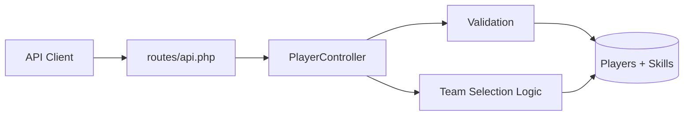
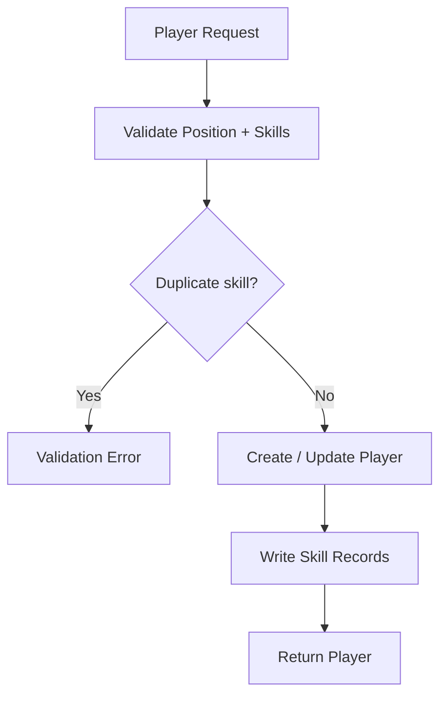
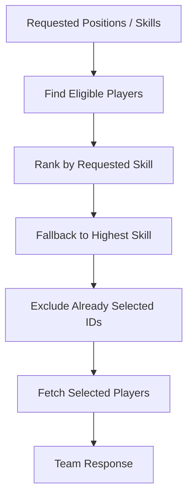
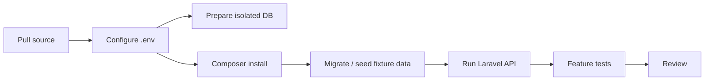
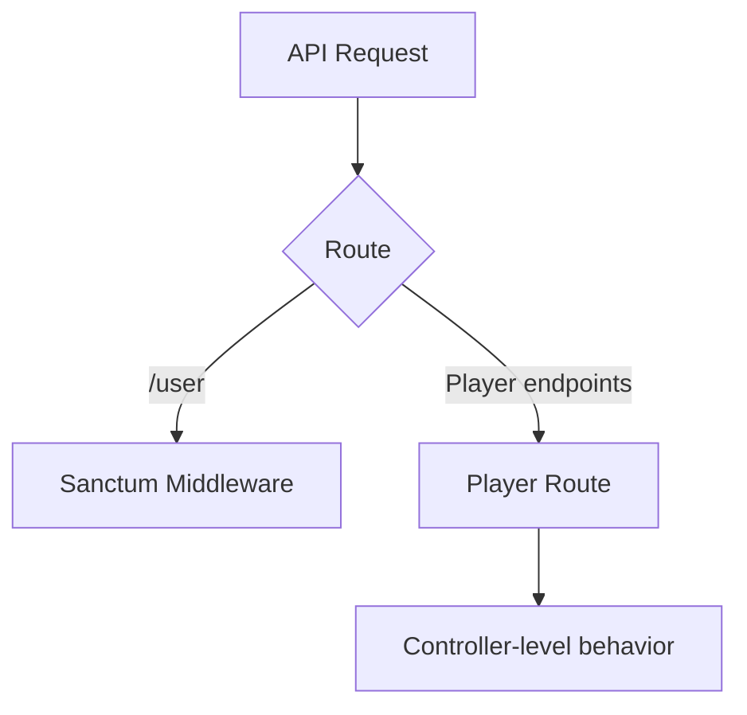
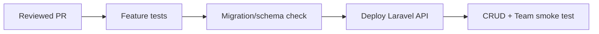

# RestFullPlayerApi — Development Pipeline

> Code-grounded architecture and delivery guide for the current repository snapshot. Reviewed from `main` at `d018da4be725` on 2026-09-17.

RestFullPlayerApi is a Laravel API for player CRUD and team selection based on position and main-skill requirements.

## 1. API architecture

## 2. Player CRUD pipeline

## 3. Team-selection pipeline

The reviewed implementation creates an intermediate ranking, but the final retrieval query does not necessarily preserve that ranking order.

## 4. Runtime ownership

| Layer | Responsibility | Key source |
| --- | --- | --- |
| Routes | API endpoint mapping | `routes/api.php` |
| Controller | CRUD + team-selection logic | `app/Http/Controllers/PlayerController.php` |
| Eloquent | Player/skill persistence | Laravel models |
| Tests | Player/team behavior | `tests/Feature/` |

## 5. Development pipeline

The inspected `package.json` exposes `npm run dev`, but the application behavior is primarily Laravel/PHP and should be validated through the PHP test/runtime tooling actually configured in the project.

## 6. Verification gates

Validate at minimum:

- Player create with valid and invalid position/skill enums.
- Duplicate-skill rejection.
- Player update preserving expected relationships.
- Unauthorized deletion.
- Team request with missing eligible players.
- Not enough players for a requested formation.
- Highest-skill fallback behavior.
- Same player never reused twice in one team.
- Final team ordering matches product expectations.
- Multi-record writes behave consistently if one write fails.

The repository contains focused feature tests for player CRUD and team selection; run them against isolated data before release.

## 7. Security path

Only `/user` uses Sanctum middleware in the inspected routes. Do not assume the same guard protects the player endpoints unless routing changes.

## 8. Release pipeline

No GitHub Actions workflow was found in the reviewed snapshot.

## 9. Known gaps

1. Player endpoints do not share the inspected Sanctum guard used by `/user`.
2. Final query ordering may differ from the intermediate ranking.
3. Multi-record writes should be explicitly tested for rollback/partial failure.
4. CI automation is not represented by `.github/workflows/` in this snapshot.

## 10. Source map

- [`routes/api.php`](https://github.com/HidayahMF/RestFullPlayerApi/blob/d018da4be72567866e54fa61e57e9a731117e223/routes/api.php)
- [`app/Http/Controllers/PlayerController.php`](https://github.com/HidayahMF/RestFullPlayerApi/blob/d018da4be72567866e54fa61e57e9a731117e223/app/Http/Controllers/PlayerController.php)
- [`tests/Feature/TeamControllerTest.php`](https://github.com/HidayahMF/RestFullPlayerApi/blob/d018da4be72567866e54fa61e57e9a731117e223/tests/Feature/TeamControllerTest.php)

Keep this guide synchronized with route protection, validation enums, team-ranking rules, and persistence changes.