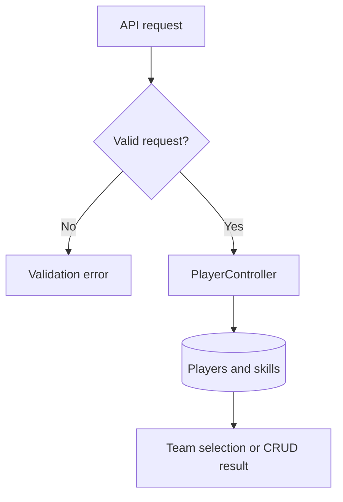

# RestFullPlayerApi — Development Pipeline

Laravel API for player CRUD and team selection by position and main skill.

> Source review: **2026-09-17**, branch `main`, commit [`d018da4be725`](https://github.com/HidayahMF/RestFullPlayerApi/commit/d018da4be72567866e54fa61e57e9a731117e223). This is a code-grounded implementation overview and development guide, not a reconstructed historical timeline or a claim that runtime tests passed.

## At a glance

| Area | Finding |
| --- | --- |
| Review scope | Repository tree, dependency manifests, and selected entry points/domain implementations linked below |
| Automated CI | No files under `.github/workflows/` in this source snapshot |
| Validation performed | Static source and documentation review; application builds, tests, databases, and external services were not executed |

## Implemented flow

1. routes/api.php dispatches player requests to PlayerController; create/update validate position and skill enums and reject duplicate skills.

2. Player and skill records are written through Eloquent; delete checks a configured bearer token.

3. processTeam ranks eligible players by requested skill with a highest-skill fallback, avoids reusing selected IDs, and returns the selected players.

### Runtime map

## Source map

Principal source files used for this overview, pinned to the reviewed commit:

- [routes/api.php](https://github.com/HidayahMF/RestFullPlayerApi/blob/d018da4be72567866e54fa61e57e9a731117e223/routes/api.php)
- [app/Http/Controllers/PlayerController.php](https://github.com/HidayahMF/RestFullPlayerApi/blob/d018da4be72567866e54fa61e57e9a731117e223/app/Http/Controllers/PlayerController.php)
- [tests/Feature/TeamControllerTest.php](https://github.com/HidayahMF/RestFullPlayerApi/blob/d018da4be72567866e54fa61e57e9a731117e223/tests/Feature/TeamControllerTest.php)

## Technology and commands

Version ranges below are declarations in source manifests, not independently verified installed versions.

| Manifest | Relevant declarations |
| --- | --- |
| [composer.json](https://github.com/HidayahMF/RestFullPlayerApi/blob/d018da4be72567866e54fa61e57e9a731117e223/composer.json) | `php ^8.1`, `laravel/framework ^9.14` |
| [package.json](https://github.com/HidayahMF/RestFullPlayerApi/blob/d018da4be72567866e54fa61e57e9a731117e223/package.json) | See manifest |

Run each command from the indicated directory after installing the corresponding dependencies and configuring an isolated development environment. Commands are listed as declared; this review does not certify they succeed.

| Directory | Command | Implementation |
| --- | --- | --- |
| `.` | `npm run dev` | Declared: `npm run development` |

## Development sequence

| Stage | Work | Completion evidence |
| --- | --- | --- |
| 1. Establish scope | Read the source map and limitations; choose one concrete behavior to change. | Expected input, output, and failure behavior. |
| 2. Prepare environment | Use the manifests and configuration references. | Required local services reachable with synthetic data. |
| 3. Implement | Follow the implemented flow and update the layer that owns the behavior. | Focused diff with matching caller/callee contracts. |
| 4. Validate | Run applicable declared checks and the scenarios below. | Recorded commands, results, and untested dependencies. |
| 5. Review and release | Review the diff and update documentation; release after environment checks. | Reviewed change and target-environment smoke check. |

These stages are a recommended maintenance sequence, not a historical timeline.

## Configuration and runtime prerequisites

- [.env.example](https://github.com/HidayahMF/RestFullPlayerApi/blob/d018da4be72567866e54fa61e57e9a731117e223/.env.example)
- [phpunit.xml](https://github.com/HidayahMF/RestFullPlayerApi/blob/d018da4be72567866e54fa61e57e9a731117e223/phpunit.xml)

Configuration-file presence does not prove deployment success. Keep credentials outside version control and use synthetic records during setup.

## Verification plan

Run player and team feature tests with isolated data; verify missing players, duplicate skill requests, insufficient players, fallback ranking, and unauthorized deletion.

Test-related files found in the repository tree (9; inventory only, not a passing-test count):

- [tests/CreatesApplication.php](https://github.com/HidayahMF/RestFullPlayerApi/blob/d018da4be72567866e54fa61e57e9a731117e223/tests/CreatesApplication.php)
- [tests/Feature/PlayerControllerBaseTest.php](https://github.com/HidayahMF/RestFullPlayerApi/blob/d018da4be72567866e54fa61e57e9a731117e223/tests/Feature/PlayerControllerBaseTest.php)
- [tests/Feature/PlayerControllerCreateTest.php](https://github.com/HidayahMF/RestFullPlayerApi/blob/d018da4be72567866e54fa61e57e9a731117e223/tests/Feature/PlayerControllerCreateTest.php)
- [tests/Feature/PlayerControllerDeleteTest.php](https://github.com/HidayahMF/RestFullPlayerApi/blob/d018da4be72567866e54fa61e57e9a731117e223/tests/Feature/PlayerControllerDeleteTest.php)
- [tests/Feature/PlayerControllerListingTest.php](https://github.com/HidayahMF/RestFullPlayerApi/blob/d018da4be72567866e54fa61e57e9a731117e223/tests/Feature/PlayerControllerListingTest.php)
- [tests/Feature/PlayerControllerUpdateTest.php](https://github.com/HidayahMF/RestFullPlayerApi/blob/d018da4be72567866e54fa61e57e9a731117e223/tests/Feature/PlayerControllerUpdateTest.php)
- [tests/Feature/TeamControllerTest.php](https://github.com/HidayahMF/RestFullPlayerApi/blob/d018da4be72567866e54fa61e57e9a731117e223/tests/Feature/TeamControllerTest.php)
- [tests/TestCase.php](https://github.com/HidayahMF/RestFullPlayerApi/blob/d018da4be72567866e54fa61e57e9a731117e223/tests/TestCase.php)
- [tests/Unit/ExampleTest.php](https://github.com/HidayahMF/RestFullPlayerApi/blob/d018da4be72567866e54fa61e57e9a731117e223/tests/Unit/ExampleTest.php)

## Known limitations and next work

Only /user uses Sanctum middleware in the inspected routes; player endpoints do not share that guard. Team selection builds an intermediate ranking but the final query need not preserve its order. Multi-record writes should be tested for rollback behavior.

Prioritize the acceptance checks above before expanding the feature set. A declared test command or example test does not establish production readiness.

## Keeping this document accurate

Update the source snapshot and affected flow when entry points, persistence, authentication, or integration contracts change. Keep planned capabilities separate from implemented behavior, and record actual build/test results only after running them.
